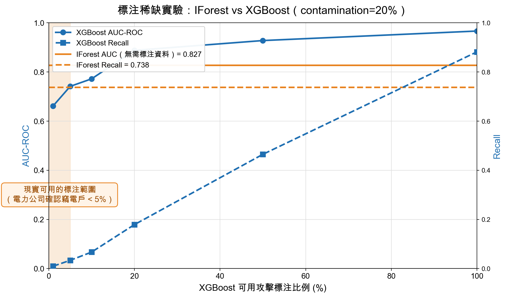
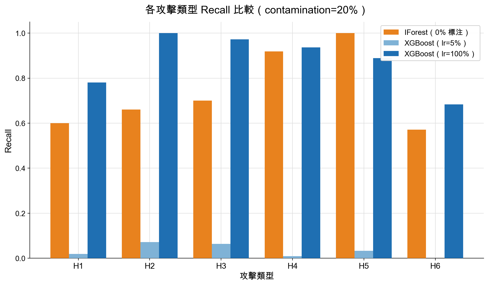
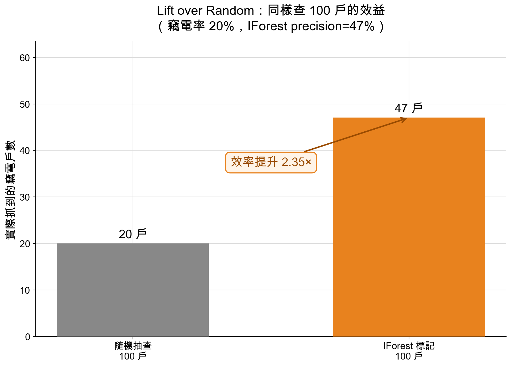

# 智慧電表異常用電偵測系統

**以非監督式機器學習偵測竊電行為的 AIoT 系統**

> AIoT 課程期末專題（2026）

---

## 專題簡介

竊電（electricity theft）是電力公司每年重大的營收損失來源。智慧電表普及後，電力公司可以取得每戶的逐時用電資料，但要從中找出竊電戶有一個現實困難：**被確認的竊電案例非常少**。傳統的監督式模型需要大量「這戶有竊電」的標注資料才能訓練，而這正是電力公司最缺乏的。

本專題提出以 **Isolation Forest（孤立森林）** 為核心的偵測方法：模型只學習「正常用電長什麼樣子」，不需要任何竊電標注，就能把偏離正常模式的用電日標記為可疑。我們並透過實驗量化：**在標注資料稀缺時，這種非監督式方法比監督式方法更實用。**

## 系統架構

```
 ┌──────────────┐      每小時用電量      ┌─────────────────────────────┐
 │   智慧電表    │ ───────────────────▶ │            雲端              │
 │   (IoT 端)    │                      │  特徵擷取 → 異常偵測模型      │
 └──────────────┘                      │            ↓                │
                                       │  Streamlit 監控儀表板        │
                                       └─────────────────────────────┘
```

- **IoT 端**：智慧電表定時回傳每戶每小時的用電量
- **雲端分析**：將每戶每天的 24 小時用電整理成一筆資料，擷取特徵後交給模型判斷是否異常
- **視覺化**：互動式儀表板，讓查核人員檢視每戶用電趨勢、被標記的異常日、以及該日各電器的用電分佈

## 研究方法

### 1. 資料集

使用英國公開資料集 **REFIT**（20 戶家庭、約兩年的真實用電紀錄），彙整為約 9,954 筆「每戶每日」用電資料，模擬智慧電表的讀數。

### 2. 模擬竊電行為

由於真實竊電資料難以取得，我們參考文獻（Jokar et al., 2016）在真實用電資料上注入六種常見竊電手法：

| 代碼 | 竊電手法 | 現實對應 |
|------|---------|---------|
| h1 | 全天用電按固定比例縮小 | 電表旁路 |
| h2 | 某段時間用電歸零 | 尖峰時段斷路 |
| h3 | 每小時用電隨機縮小 | 干擾電表的電子裝置 |
| h4 | 以日平均值乘上隨機比例回報 | 偽造讀數 |
| h5 | 全天回報固定值 | 電表凍結 |
| h6 | 用電時間前後顛倒 | 尖離峰時段對調套利 |

### 3. 特徵設計

從每日 24 小時的用電曲線中，擷取 14 個具物理意義的特徵，例如平均用電、尖峰/平均比、用電曲線平滑程度、零用電時段比例、以及早/午/晚/夜各時段的用電量。

### 4. 模型

| 模型 | 類型 | 是否需要竊電標注 |
|------|------|-----------------|
| **Isolation Forest**（本專題主模型） | 非監督式 | **不需要** |
| XGBoost（比較基準） | 監督式 | 需要 |

每一戶各自訓練一個模型，讓模型學習「這一戶自己的正常用電習慣」，而不是用一個標準套用所有家庭。

## 主要實驗與結果

### 實驗設計：標注資料不足時，誰比較好？

現實中電力公司已確認的竊電戶通常不到 5%。為了模擬這個情境，我們讓 XGBoost 只看得到部分比例（1%～100%）的竊電標注，並與完全不用標注的 Isolation Forest 比較。評估時依時間切分：每戶前 70% 的日子用於訓練、後 30% 用於測試，避免「用未來資料預測過去」。



| 模型 | 可用竊電標注 | AUC | Recall（抓到的竊電比例） |
|------|------------|-----|------------------------|
| **Isolation Forest** | **0%** | **0.827** | **73.8%** |
| XGBoost | 1% | 0.662 | 1.0% |
| XGBoost | 5% | 0.741 | 3.4% |
| XGBoost | 10% | 0.772 | 6.7% |
| XGBoost | 100% | 0.967 | 88.2% |

<sub>竊電戶比例設定為 20%，結果為 20 戶的整體測試集表現。</sub>

**觀察：**
- 在標注只有 1%～10% 的現實情境下，Isolation Forest 的 AUC 與 Recall 都明顯優於 XGBoost
- XGBoost 需要約 10%～20% 的竊電標注才追得上；但在標注充足時，監督式方法仍然較強——兩者適用情境不同
- 即使只有 10% 標注，XGBoost 只抓到 6.7% 的竊電；Isolation Forest 不需標注就能抓到 73.8%

### 對各種竊電手法的偵測能力



Isolation Forest 對「電表凍結（h5）」、「偽造讀數（h4）」幾乎全部抓到；對「用電時間顛倒（h6）」較弱，因為這種手法不改變一天的總用電量，只改變時間分佈。這也是我們後續嘗試加入時段特徵改進的方向。

### 實務意義：比隨機抽查有效多少？



若竊電戶佔 20%，隨機抽查 100 戶平均只會找到 20 戶竊電；依模型標記去查，可以找到約 47 戶，**查核效率提升約 2.35 倍**。對電力公司而言，「漏抓竊電戶」的代價通常高於「多查一戶正常用戶」，因此我們以 Recall 為主要指標。

## 監控儀表板

以 Streamlit 製作的互動式儀表板，包含三個分頁：

1. **住戶用電**：每戶的每日用電時序圖，並標示模型判定的異常日
2. **警示詳情**：點選可疑日期，檢視當天每小時用電與各電器用電佔比，協助查核人員判斷原因
3. **模型比較**：Isolation Forest 與不同標注比例的 XGBoost 在各項指標上的比較

## 專案結構

```
aiot_nilm/
├── main.py                     # 指令入口（資料準備、訓練、比較實驗、儀表板）
├── src/
│   ├── data/                   # REFIT 資料載入、竊電行為注入
│   ├── features/               # 特徵擷取
│   ├── models/                 # Isolation Forest、XGBoost、電器用電歸因
│   └── app/dashboard.py        # Streamlit 儀表板
├── results/                    # 實驗結果
└── Docs/                       # 報告、圖表、參考文獻
```

## 如何執行

需求：Python 3.13+、[uv](https://github.com/astral-sh/uv)，並將 [REFIT 資料集](https://pureportal.strath.ac.uk/en/datasets/refit-electrical-load-measurements-cleaned) 的 CSV 放在 `REFIT/` 資料夾。

```bash
uv sync                                   # 安裝套件
uv run main.py prepare-data               # 資料前處理（只需執行一次）
uv run main.py train --features engineered --scope per-house
uv run main.py compare \
  --contaminations 0.05 0.10 0.15 0.20 \
  --label-ratios 0.01 0.05 0.10 0.20 0.50 1.0 \
  --scope per-house                       # 標注稀缺比較實驗
uv run main.py dashboard --features engineered --scope per-house
```

## 限制與未來方向

- **竊電資料為模擬注入**：真實竊電行為可能更隱蔽多變，未來若能取得真實標注資料，可進一步驗證
- **時間型攻擊偵測較弱**：如 h6 這類只改變用電時間分佈的手法，需要更能描述時間模式的特徵或模型
- **半監督式方法**：結合少量標注與大量未標注資料，可能兼得兩種方法的優點

## 參考文獻

- P. Jokar, N. Arianpoo, and V. C. M. Leung, "Electricity Theft Detection in AMI Using Customers' Consumption Patterns," *IEEE Transactions on Smart Grid*, 2016.
- D. Murray, L. Stankovic, and V. Stankovic, "An electrical load measurements dataset of United Kingdom households from a two-year longitudinal study," *Scientific Data*, 2017.（REFIT 資料集）
- F. T. Liu, K. M. Ting, and Z.-H. Zhou, "Isolation Forest," *IEEE ICDM*, 2008.
