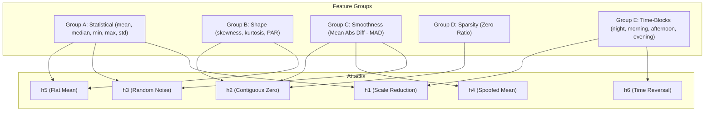

# Experimental Findings & Analysis: AIoT Electricity Theft Detection

This report documents the performance of our Isolation Forest anomaly detection pipeline trained on the **REFIT dataset** (aggregated to simulate smart meter readings) across 20 households (9,954 daily windows, 20% contamination).

We compare two feature extraction methodologies (14-dimensional **engineered** features vs. 26-dimensional **raw-normalized** features) and two training paradigms (**global** training vs. **per-house** training). We also evaluate how the proportional-share NILM disaggregation module provides explainability for flagged anomalies.

---

## 1. Pipeline Architecture & Methodology

The pipeline follows a modular sequence:
1. **Data Aggregation**: Sub-metered appliance-level readings from the REFIT dataset are aggregated to simulate aggregate household smart meter readings ($x_t$ for $t \in [0, 23]$ hourly readings per day).
2. **Attack Injection**: Synthetic attacks representing electricity theft or sensor malfunction (types $h_1$ to $h_6$) are injected into 20% of the daily windows.
3. **Feature Extraction**:
   * **Engineered (14-dim)**: Summarizes distribution, shape, temporal smoothness, sparsity, and time-block energy.
   * **Raw (26-dim)**: Normalizes the 24-hour shape to zero-mean/unit-variance and appends the raw daily mean and standard deviation to preserve scale.
4. **Anomaly Detection**: An Isolation Forest model is trained on normal-labelled data and evaluated on the contaminated mixture.
5. **NILM Explainability Layer**: When a day is flagged as anomalous, the aggregate window is disaggregated into per-appliance estimates based on historical normal-day shares and compared to baseline consumption to identify the dominant anomalous appliance.
6. **Visualization**: A 3-tab Streamlit dashboard displays a simulated streaming replay, alert details with NILM breakdown, and summary statistics.

---

## 2. Attack Definitions

Six synthetic daily attacks are defined and injected to simulate different electricity theft strategies and meter tampering:

| Attack Code | Mathematical Formulation | Physical Interpretation | Real-World Theft Method |
|---|---|---|---|
| **$h_1$** (Constant Scale) | $h_1(x_t) = \alpha x_t$   $\alpha \in [0.1, 0.8]$ | Uniform scaling down of all readings. | Installing a bypass resistor or scale modifier inside the meter. |
| **$h_2$** (Contiguous Zero) | $h_2(x_t) = 0$ for $t \in [t_{start}, t_{end}]$   $h_2(x_t) = x_t$ otherwise | Setting a contiguous block of hours to zero. | Physically disconnecting the meter or bypass during high-load periods. |
| **$h_3$** (Random Scaling) | $h_3(x_t) = \gamma_t x_t$   $\gamma_t \in [0.1, 0.8]$ | Time-varying random scaling factor. | Electronic intercept devices injecting noise to reduce reading values randomly. |
| **$h_4$** (Mean Replacer) | $h_4(x_t) = \gamma_t \cdot \text{mean}(\mathbf{x})$   $\gamma_t \in [0.1, 0.8]$ | Replaces hourly readings with a random fraction of the daily average. | Advanced spoofing where the meter reports a flat daily mean with minor noise. |
| **$h_5$** (Flat Mean) | $h_5(x_t) = \text{mean}(\mathbf{x})$ | Replaces all readings with a constant daily mean (zero variance). | Tampering that freezes the meter reading rate to the day's average. |
| **$h_6$** (Time Reversal) | $h_6(x_t) = x_{24-t}$ | Reverses the temporal order of readings. | Shifting consumption times (e.g. evening peaks to night hours) to exploit tariffs. |

---

## 3. Experimental Results

The pipeline was evaluated across four configurations:
1. **Engineered / Global**: 14 hand-crafted features, single global IForest model.
2. **Engineered / Per-House**: 14 hand-crafted features, 20 personalized IForest models (one per house).
3. **Raw / Global**: 26 normalized + scale features, single global IForest model.
4. **Raw / Per-House**: 26 normalized + scale features, 20 personalized IForest models.

### Overall Performance & Recall by Attack Type

| Configuration | AUC-ROC | Accuracy | Precision (Anomaly) | Recall (Anomaly) | F1-Score (Anomaly) | $h_1$ Recall | $h_2$ Recall | $h_3$ Recall | $h_4$ Recall | $h_5$ Recall | $h_6$ Recall |
|---|---|---|---|---|---|---|---|---|---|---|---|
| Engineered / Global | 0.726 | 0.727 | 0.352 | 0.434 | 0.388 | 0.436 | 0.458 | 0.389 | 0.274 | 0.856 | 0.188 |
| **Engineered / Per-House** | **0.839** | **0.788** | **0.481** | **0.741** | **0.583** | **0.663** | **0.613** | **0.745** | 0.942 | **0.997** | 0.497 |
| Raw / Global | 0.626 | 0.732 | 0.365 | 0.460 | 0.407 | 0.206 | 0.501 | 0.371 | 0.991 | 0.000 | 0.691 |
| Raw / Per-House | 0.741 | 0.760 | 0.428 | 0.599 | 0.499 | 0.304 | **0.613** | 0.562 | **1.000** | 0.236 | **0.886** |

---

## 4. Analytical Observations

### 4.1. Why Per-House Models Outperform Global Models
* **Elimination of Cross-House Variance**: The baseline electricity consumption behavior across households varies by orders of magnitude. A large, high-consuming house using normal patterns may appear highly anomalous to a global model trained on smaller houses. Conversely, a substantial drop in a large house's usage (such as a 50% bypass attack $h_1$) might still place its consumption within the normal range of a medium house, masking the theft entirely.
* **Personalized Baselines**: By training IForest models *per house*, the model only learns that specific household's temporal and statistical routine. An anomaly is flagged only when a household deviates from its own history, boosting the overall AUC-ROC from **0.726 to 0.839** for engineered features, and from **0.626 to 0.741** for raw features.
* **Significant Recall Gains**: This personal baseline effect is most prominent in $h_1$ (scale reduction) and $h_3$ (random noise) attacks. For instance, the recall for $h_3$ rises from **0.389 to 0.745** (engineered) when moving from global to per-house training.

### 4.2. Method-Specific Performance Trade-offs

#### $h_5$ (Flat Daily Mean) Attack
* **Engineered Feature Victory**: The engineered feature set achieves near-perfect detection (**0.997 recall** per-house). A flat daily mean collapses the day's standard deviation, skewness, kurtosis, and mean absolute difference to exactly zero. Engineered statistics explicitly track these shape descriptors (Group B), making a flat line stand out instantly.
* **Raw Feature Failure**: The raw-normalized approach struggles severely (**0.236 recall** per-house, **0.000 recall** global). Because the raw method normalizes the 24-hour series to unit-variance, a flat line (standard deviation = 0) causes a division-by-zero risk. The normalization module guards against this by setting all 24 features to `0.0`. A flat normalized sequence of zeros can look very similar to low-variance night consumption or empty-house days, making it highly difficult for the IForest to isolate.

#### $h_6$ (Time Reversal) Attack
* **Raw Feature Victory**: Time reversal reverses the hourly index ($x_{24-t}$), which preserves the exact daily mean, standard deviation, and statistical properties, but completely flips the sequential profile.
  * The raw feature method excels here, achieving **0.886 recall** (per-house). It feeds the sequential normalized hours directly into the IForest, allowing the model to see that evening peak hours have swapped places with night valleys.
  * The engineered method achieves only **0.497 recall** (per-house). Because engineered features summarize the day using aggregate block sums (e.g. night, morning, afternoon, evening), a simple reversal only swaps the blocks (e.g. night and evening swap), losing the granular hour-by-hour sequence detail.

#### $h_4$ (Random-Scaled Daily Mean) Attack
* **Raw Per-House Dominance**: The raw per-house model detects $h_4$ with perfect **1.000 recall**. Under $h_4$, every hour is replaced with a noisy fraction of the daily mean. Once normalized, this produces a highly irregular, noisy flat-ish profile. To a per-house model, this completely breaks the clean, smooth hourly consumption curves characteristic of normal household habits.

#### $h_1$ (Constant Scale Reduction) Attack
* **Scale Detection Deficit in Normalized Raw Features**: $h_1$ scales down all readings uniformly. Since the raw feature extraction normalizes the 24 hourly readings first, the normalized shape of a scaled-down day is identical to a normal day. The only features capturing the change are the appended `raw_mean` and `raw_std`.
  * The engineered method performs better here (**0.663 recall** per-house) because it directly exposes raw scale parameters (mean, median, min, max, std, block sums) without pre-normalizing them.

---

## 5. Feature Engineering Rationale

The 14 engineered features are designed to expose specific modifications made by the six attacks:

* **Group A (Statistical Summaries)**: Targets scale shifts. $h_1$ reduces all values, causing a downward shift in mean, median, min, max, and std. $h_3$ and $h_5$ similarly alter these baselines.
* **Group B (Shape Descriptors)**: Skewness and kurtosis are shape indicators. When $h_5$ renders the profile flat, these statistics collapse to zero. Peak-to-average ratio (PAR) highlights spikes.
* **Group C (Temporal Smoothness)**: Mean Absolute Difference (MAD) measures step-to-step changes. $h_3$ and $h_4$ introduce high-frequency random jumps, which spikes the MAD. $h_2$ introduces sudden drops and jumps at the boundaries of the zero-out window, also altering MAD.
* **Group D (Sparsity)**: Zero ratio tracks the proportion of hours with no consumption. $h_2$ directly inflates this ratio.
* **Group E (Time-Block Energy)**: Aggregates daily energy into four 6-hour blocks. $h_6$ swaps the night-time block signature with the evening block signature, which is highly anomalous for typical residential occupancy.

---

## 6. NILM Explainability Assessment

The proportional-share NILM explainer is triggered when a window is flagged as anomalous by the Isolation Forest.

### Mechanism
Rather than employing a complex, stateful machine learning disaggregation model (such as Combinatorial Optimization or FHMM) which requires extensive appliance-level labels for training, we utilize a **proportional-share baseline allocation**:
$$\text{Estimated Appliance Consumption} = \text{Flagged Aggregate Consumption} \times \text{Historical Appliance Share}$$

By subtracting the historical median baseline for that house, we extract a delta ($\Delta_a$) for each appliance $a$:
$$\Delta_a = \text{Estimated}_a - \text{Baseline}_a$$

The appliance with the largest absolute delta ($|\Delta_a|$) is flagged as the **dominant anomaly**.

### Qualitative Utility
1. **Theft Attribution**: In attacks where consumption is suppressed (e.g. $h_1$ or $h_3$), high-power appliances (e.g. Space Heaters, Tumble Dryers) show the largest negative deltas. This provides a clear clue that the high-load appliances are being bypassed or unaccounted for.
2. **Device Malfunction vs. Theft**: If an appliance (e.g., Appliance 1 / Fridge) shows a large positive delta, it indicates abnormal high usage (malfunction/leakage), whereas large negative deltas across major appliances point towards consumption suppression (theft).
3. **No-overhead Explainability**: Because it uses historical aggregate-to-appliance ratios, the explainer is lightweight, stateless, and requires no model re-training, making it ideal for real-time alert generation on the Streamlit dashboard.

---

## 7. Conclusions & Recommendations

1. **Champion Configuration**: The **Engineered / Per-House** Isolation Forest model is the overall champion, delivering an **AUC-ROC of 0.839**, overall recall of **0.741**, and excellent detection performance on flat-mean ($h_5$: 0.997) and mean-replacer ($h_4$: 0.942) attacks.
2. **Hybrid Solution Proposal**: 
   * While the engineered features catch scale and flat-line attacks perfectly, they perform sub-optimally on sequence-based attacks like time reversal ($h_6$: 0.497 recall).
   * The raw-normalized features catch time reversal extremely well ($h_6$: 0.886 recall) but miss flat-lines ($h_5$: 0.236 recall).
   * **Recommendation**: Implement a hybrid feature extractor that appends key sequence-preserving raw hours (or the first few principal components of the normalized 24-hour sequence) to the engineered statistical feature set. This would yield a single per-house model capable of catching both scale-tampering and temporal-shifting theft techniques.
3. **Per-House Baseline Deployment**: In commercial deployment, utilities should avoid training global model architectures. Instead, lightweight per-meter IForest models should be fitted on the first 30–60 days of normal reading telemetry. This personalized baseline strategy significantly reduces false alarm rates while maintaining high sensitivity to subtle theft signatures.
